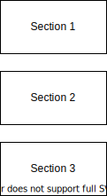

# readme-template (Project's title goes here)

## Description

The goal of this template is to have a common starting point for the application support team's projects README.md documentation.

This README.md file is intended to be used as an example of how to approach the README.md file for your project.

A project diagram can help the reader grasp concepts of your project at a glance.

https://medium.com/the-internal-startup/how-to-draw-useful-technical-architecture-diagrams-2d20c9fda90d

http://draw.io
https://marketplace.visualstudio.com/items?itemName=hediet.vscode-drawio

You can find a list of curated README.md files [here](https://www.freecodecamp.org/news/how-to-write-a-good-readme-file/)

## Requirements

In this section we can list any requirements that need to be met by the project, such as application software versions, required libraries or frameworks, optional services, etc. The requirements can be presented in list form to be easier to identify.

- Text editor 
- Browser to check code (optional)
- git client to pull template repository (optional)

## Installation

Installing this README.md template can be done by getting the document in any fashion, such as pulling from the main repository and copying the README_TEMPLATE.md file over to your project's README.md file.

A simple way of getting the template is 

## Usage

After copying the template over to your project you can simply start typing! 

## Contributing

If you would like to contribute to this project please follow these steps:

1. Make a comment on a github issue you would like to work on or create one if there isn't one.
2. Create a new branch from the main branch with a name that describes what the purpose of the branch might be.
3. Add your changes to branch and push to origin when you are ready to share your work.
4. Create a pull request from that branch. Don't forget to request someone a code review!
5. After resolving any issues that might come up with the code review and your changes are approved you can merge the changes in your branch.

## Sections

This README.md template is not meant to be a "one size fits all" solution, but rather, a good starting point to which we can add different sections where the need arises.

## Assumptions

## Definitions

## Badges

Badges can give a quick overview of the state of the repository, be sure to add the badges from github actions XXX, or add more from the ones available from https://shields.io/.

You should add the badges on top of the description of the project to give the reader a read of the project at a glance.

## References

https://github.com/matiassingers/awesome-readme

